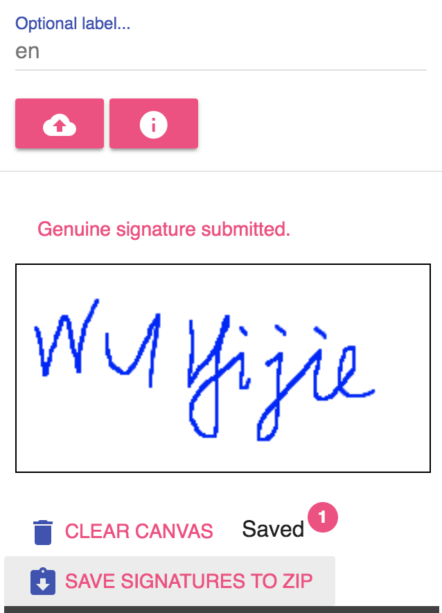
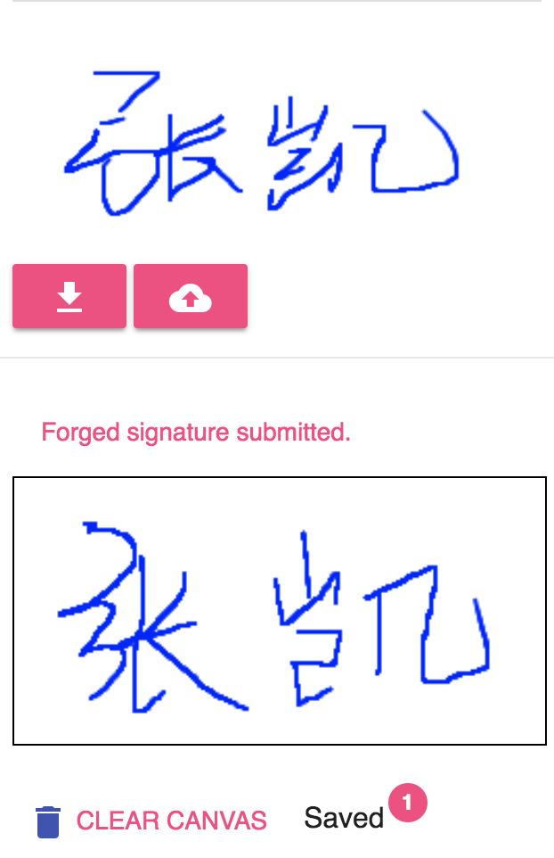

## Instruction for using the signature collecting tool

(This instruction can be downloaded as [pdf](https://musicai.github.io/SV/instruction/instruction.pdf))

### Supported Platform

Desktop browser with mouse events, Andoid/iOS devices with touch events.

Other pointer events like stylus or pens currently are not supported (e.g., Surface)

Go to https://musicai.github.io/SV . You may try to draw on the canva to see if your browser is supported.

### Steps of using the tool

**Step 1**: Input the passphrase posted on Moodle.

**Step 2**: Select `genuine` to submit your genuin signatures or `forged` to imitate others' signatures.

**To submit genuine signatures** (step 3 ~ 8):

**Step 3**: Input your surname and first name. 

If the passphrase is correct, you can sellect from the auto-completion results. Note the name should be exactly the same as in your records on Moodle.

**Step 4**: If the name is correct, you can click the info button to see the number of signatures you already collected.

**Step 5**: Draw your signature on the box below. It may be easier to sign on the screen tablets or phones using fingers.

**Step 6**: Fill in your personal information (student ID and Assignment 1 score) and the optional label.  

Note that your name, student ID and score should be correct (these secret information is used for authentication). If you have different vertions of signatures, you may need the optional labels to distinguish.

**Step 7**: Click the upload button to submit your signature. 

After successful upload, you can see the number on the badge increases by one. Then you can safely clear the canvas and draw another new one. The uploaded signatures will be saved temporarily before you leave the page. 

**Step 8**: Save all signatures in one session to a zip file. 

The zip file also contains a sequence of strokes (arrays of $(x,y)$ coordinates), through which you may to experiment the time dependency aspect of your signatures

Recently, we add a download button next to the info button for you to download all uploaded data (with .csv files containing labels and timestamps). These files are updated on an hourly basis (later we may also include normalized data, currently you can use [sample code](https://musicai.github.io/SV/tool/index.html) for image processing and data normalization)

**To submit forged signatures** (step 9 ~ 11):

**Step 9**: Switch to the `forged` tab, and input the target name (using auto-completion again). 

**Step 10**: Lick the download button (next to the upload button). 

If your target already upload the genuine signature, it will be displayed below for you to imitate.

**Step 11**: Draw the forged signature in the box below, click the upload button to submit. 

Note that the number on the badge won't change, and you will not be able to download these signatures. You can ask friends to pick you as target and later on you will be able to download these forged signatures for training.

## Q & A

This section is ontinuously updated. 

**Q**: Can I remove part of the uploaded data?

**A**: You can use the label and timestamp to select the training data.

**Q**: What should I do if the canvas drawing does not work?

**A**: Try to switch browsers first if you find troubles using the tool (Chrome and Firefox are recommended). Also make sure you can access Google services, otherwise you may need  VPN (especially when you are in mainland China).

**Q**: Can I use other tool to collect the data?

**A**: Sure. We provide this tool just to make it easy to collect forged signatures from your friends. If you prefer scanning/taking photo of signatures on the paper, you may need to preprocess the data on your own.

**Q**: What is in the zip file after I download all signatures?

**A**: All the `png` and `json` files uploaded will be placed under the directory `original/`, and `png.csv` and `json.csv` contains summary information of the dataset such as `signature_id`, `label`, `time_stamp`, `type` (genuine or forged), etc. For genuine signatures, `label` may be empty if you did not specify when uploaded them. For forged signature, `label` is the `signature_id` of referenced genuine signature, where the invalid `signature_id` like `e3b0c442` and `eb045d78` just stand for empty signatures (the imposters may randomly draw something without downloading your genuine signature for reference).

**Q**: Why is the same `signature_id` used in different rows in the summary csv file?

**A**: The `signature_id` is the hash value of the dataurl  of the signature png file, serving as a unique identifier for signature image. If you upload the same signatures multiple times (e.g., applying different labels), there may be multiple rows and png (json) file using the same `signature_id`.

**Q**: Why is the zip with all signatures missing recently submitted signatures?

**A**: Normally the zip file will be updated on an hourly basis. Sometimes due to shortage of idle gitlab runners, the update may be postponed. Be patient and finish data collection as early as possible.

**Q**: Why do the numbers of signatures obtained through the info button decrease sometimes?

**A**: The numbers provided instantly may not be accurate due to race conditions caused by simultaneous submissions. Besides, we de-duplicate signatures when preparing the zip files, thus the actual numbers of collected signatures will also be revised periodically.

**Q**: Can I know the signatures are collected from mobile devices (using touch screen) or from desktops (using mouse or touchpad)?

**A**: We do not provide device information in the summary csv file. But for signatures collected through touch screen, the array for each stroke in the json files will always start with `[0,0]`. You may use such additional information to filter out signatures collected from mobile devices, which tend to have higher quality than those collected from desktop.

You are welcome to email me if you have further questions or other suggestions.