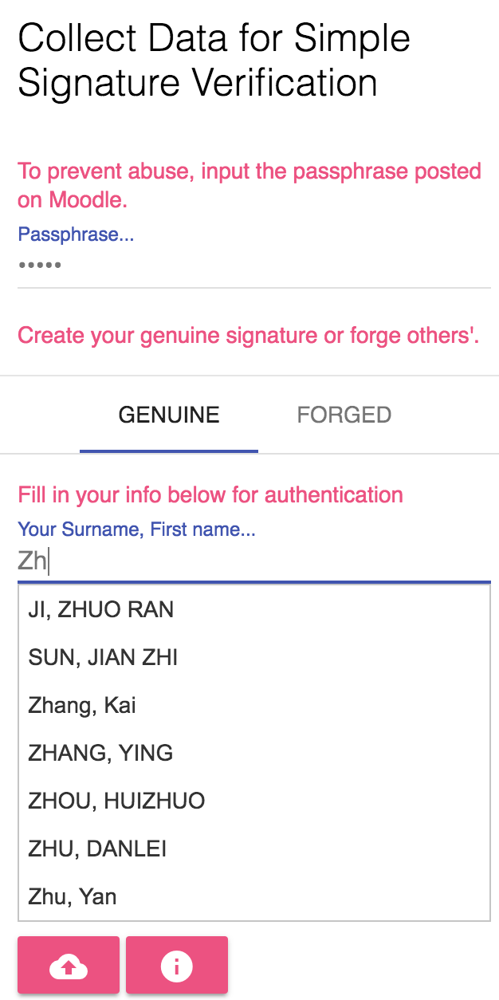
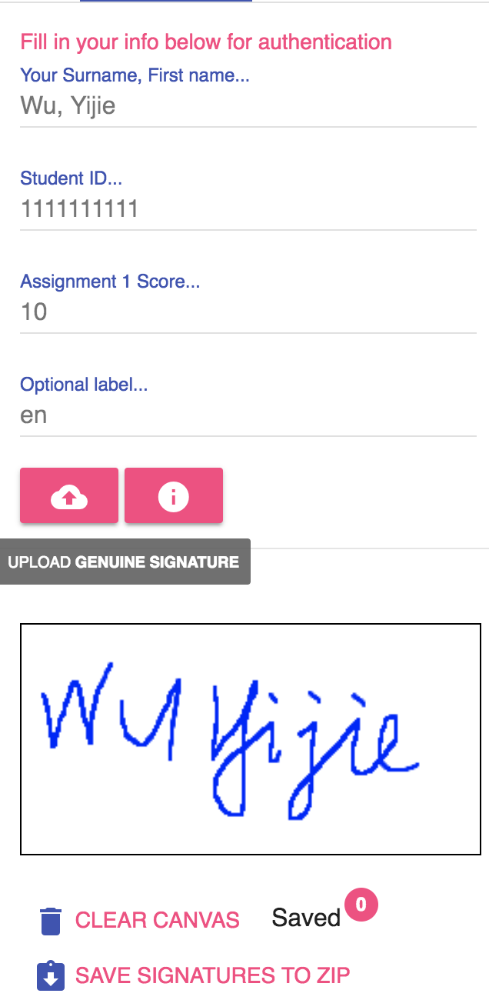

# Instructions for using the signature generating tool

## Supported Platform

Desktop Browser with mouse events, Andoid/iOS devices with touch events.

Other pointer events like stylus or pens currently are not supported (e.g., Surface)

## Steps of using the tool

Go to https://musicai.github.io/SV

Input the passphrase posted on Moodle.

Select `genuine` or `forged`

**To submit genuine signatures**:

Input your Surname and first name. If the passphrase is correct, you can sellect from the auto-completion results. Note the name should be exactly as in your records on Moodle.

You can click the info button to see the number of signatures you already collected:

Then you can draw on the box below.

After filling in your personal information (including your student ID and Assignment score)  you can click the upload button to submit your signature. Note that your name, student ID and score should be the correct (these secret information is used for authentication). And the label is optional (for example, if you have different vertions a signatures, you may need the labels to distinguish).

Click the upload button, you can see the number on the badge increase one. Then you can safely clear the canvas and draw another new one. All saved signature in one session can be downloaded as a zip. The zip file will also include the sequences of $(x,y)$ coordinates of your signatures (if you want to experiment on the time dependency aspect)

Recently, we add a download button next to the info button for you to download all uploaded data (with .csv files containing labels and timestamps). These files are updated every hour (later we may also include preprocessed data, currently you can use [sample code](https://musicai.github.io/SV/tool/index.html) for image processing and data normalization)

**To submit forged signatures**:

You switch to the `forged` tab, and input the target name (using auto-completion again). Then click the download button (next to the upload button). If your target already upload the genuine signature, it will be displayed below for you to imitate.

After drawing the forged signature, click the upload button to submit. Note that the number on the badge won't change, and you will not be able to download these signature; instead,  you can ask friends to pick you as target and later on we will give you these forged signatures for training.

## Q & A

We will continuously update this section. 

**Q**: Can I remove some of the uploaded data?

**A**: You can use the label and timestamp to select the training data.

**Q**: What should I do if the canvas drawing does not work?

**A**: Try to switch browsers first if you find troubles using the tool (Chrome and Firefox are recommended). 

**Q**: Can I use other tool to collect the data?

**A**: Sure. We provide this tool for you just to make it easy to collect forged signatures from your friends. If you prefer scanning/taking photo of signatures on the paper, you may need to preprocess the data on your own.

You can also email me if you have other questions or suggestions.